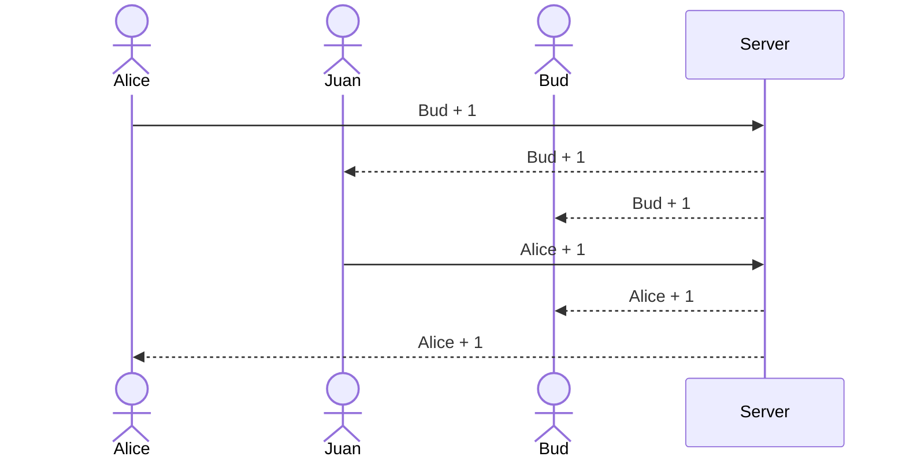

# Voter

This application serves as an example for the information you must provide in your Start Up `README.md` file for each phase of your development. You only need to fill in the section for the deliverable when you submit that deliverable in Canvas. This allows the TA to know what should be graded.

The specification deliverable section defines what your application will do. The rest of the deliverable sections reference the rubric for the deliverable and tell where the functionality is in your application, or documents that you did not satisfy that part of the rubric.

## Specification Deliverable

For this deliverable I did the following.

- [x] I completed the prerequisites for this deliverable (Git commit requirement)
- [x] Proper use of Markdown
- [x] A concise and compelling elevator pitch
- [x] Description of key features
- [x] Description of how you will use each technology
- [x] One or more rough sketches of your application. Images must be embedded in this file using Markdown image references.

### Elevator pitch

Have you ever endlessly debated with your friends about where to meet for lunch, or had your team bog down about an important decision that needs to be made? The Voting application makes it so a group of people can pull out their phones, clearly see the options, and pick their top three choices. As each user makes their choices the results are automatically tallied and displayed in realtime to all the other group members. Once everyone locks in their choices the group can move forward with confidence that the best option has been selected.

### Design


Here is a sequence diagram that shows how to people would interact with the backend to vote.



### Key features

- Secure login over HTTPS
- Ability to select the question to decide
- Display of choices
- Ability to select, and change, top three choices
- Totals from all users displayed in realtime
- Ability for a user to lock in their top three
- Results are persistently stored
- Ability for admin to create and delete questions

### Technologies

I am going to use the required technologies in the following ways:

- **HTML** - Uses correct HTML structure for application. Two HTML pages. One for login and one for voting. Hyperlinks to choice artifact.
- **CSS** - Application styling that looks good on different screen sizes, uses good whitespace, color choice and contrast.
- **React** - Provides login, choice display, applying votes, display other users votes, and use of React for routing and components.
- **Service** - Backend service with endpoints for:
  - login
  - retrieving choices
  - submitting votes
  - retrieving vote status
- **DB/Login** - Store users, choices, and votes in database. Register and login users. Credentials securely stored in database. Can't vote unless authenticated.
- **WebSocket** - As each user votes, their votes are broadcast to all other users.

## Deployment instructions

1. Clone this repository to your development environment.
1. Create a `dbConfig.json` file that contains the credentials to access your Mongo Database. This must be placed in the root of the project.

   ```json
   {
     "hostname": "YourMongoDbAccount.xiu1cqz.mongodb.net",
     "userName": "YourMongoDbUsername",
     "password": "YourMongoDbPassword"
   }
   ```

1. NPM install both the frontend and backend dependencies.

   ```sh
   npm install
   cd ui
   npm install
   cd ..
   ```

1. Use the `deploy.sh` shell script to deploy Voter to an EC2 instance. You will need the PEM key in order to run the script.

   ```sh
   ./deploy.sh -k ~/keys/yourkeyhere.pem -h yourdomainnamehere.click
   ```

1. Verify that the application is running on the domain.

   ```sh
   curl startup.cs260.click
   ```

1. **Optional**: If you want to modify the candidates that are currently voted on then alter `finalists.json`. The format of the file is as follows:

   ```json
   {
     "candidate": [{ "name": "Meg", "url": "https://game.com", "votes": 0, "id": "game" }]
   }
   ```

   You can update the candidates with the following endpoint call:

   ```sh
   curl -X PUT localhost:4000/api/candidate -H "Content-Type:application/json" --data '@finalists.json'
   ```

## HTML deliverable

For this deliverable I built out the structure of my application using HTML.

- [x] I completed the prerequisites for this deliverable (Simon deployed, GitHub link, Git commits)
- [x] **HTML pages** - Two HTML page that represent the ability to login and vote.
- [ ] **Proper HTML element usage** - I just used `div` elements for everything.
- [x] **Links** - The login page automatically links to the voter page. The voter page contains links for every voting choice.
- [x] **Text** - Each of the voting choices is represented by a textual description.
- [x] **3rd party API placeholder** - Placeholder for calls to OpenAI.
- [ ] **Images** - I couldn't figure out how to include an image and so I didn't do this. 😔
- [x] **DB/Login** - Input box and submit button for login. The voting choices represent data pulled from the database.
- [x] **WebSocket** - The count of voting results represent the tally of realtime votes.

## CSS deliverable

For this deliverable I properly styled the application into its final appearance.

- [x] I completed the prerequisites for this deliverable (Simon deployed, GitHub link, Git commits)
- [x] **Visually appealing colors and layout. No overflowing elements.** - Looks great, but maybe needs more work on the bouncy ball shadow.
- [x] **Use of a CSS framework** - I used tailwind CSS
- [x] **All visual elements styled using CSS** - Yep!
- [x] **Responsive to window resizing using flexbox and/or grid display** - Looks great on different window sizes and devices
- [x] **Use of a imported font** - Quicksand! The best font ever.
- [x] **Use of different types of selectors including element, class, ID, and pseudo selectors** - Used them all. See the voter page.

## React Phase 1: Routing deliverable

For this deliverable I used JavaScript and React so that the application completely works for a single user. I also added placeholders for future technology.

- [x] I completed the prerequisites for this deliverable (Simon deployed, GitHub link, Git commits)
- [x] **Bundled using Vite** - So amazing what Vite does. Bundling, transpiling, minifying, and HMR.
- [x] **Components** - I have three components: The app, the ballot items, and a bouncy ball.
- [x] **Router** - Routing between login and voting components.

## React Phase 2: Reactivity deliverable

For this deliverable I used JavaScript and React so that the application completely works for a single user. I also added placeholders for future technology.

- [x] I completed the prerequisites for this deliverable (Simon deployed, GitHub link, Git commits)
- [x] **All functionality implemented or mocked out** - Everything is working! Votes stored in local storage. `setInterval` used to simulate peer voting.
- [x] **Hooks** - Used `useState` and `useEffect` on the voter view.

## Service deliverable

For this deliverable I added backend endpoints that receives votes and returns the voting totals.

- [x] I completed the prerequisites for this deliverable (Simon deployed, GitHub link, Git commits)
- [x] **Node.js/Express HTTP service** - done!
- [x] **Static middleware for frontend** - done!
- [ ] **Calls to third party endpoints** - I didn't have time to implement this. 😔
- [x] **Backend service endpoints** - Placeholders for login that stores the current user on the server. Endpoints for voting.
- [x] **Frontend calls service endpoints** - I did this using the fetch function.
- [ ] **Supports registration, login, logout, and restricted endpoint** - Login only exists on the frontend.
- [ ] **Uses BCrypt to hash passwords** - This is found in the login.js file.

## DB/Login deliverable

For this deliverable I associate the votes with the logged in user. I stored the votes in the database.

- [x] I completed the prerequisites for this deliverable (Simon deployed, GitHub link, Git commits)
- [x] **Stores data in MongoDB** - Stores both user and their votes. See database.js
- [x] **Use MongoDB to store credentials** - Stores user and credentials. See database.js

## WebSocket deliverable

For this deliverable I used webSocket to update the votes on the frontend in realtime.

- [x] I completed the prerequisites for this deliverable (Simon deployed, GitHub link, Git commits)
- [x] **Backend listens for WebSocket connection** - See vote.js
- [x] **Frontend makes WebSocket connection** - See voter.jsx
- [x] **Data sent over WebSocket connection** - See service.js
- [x] **WebSocket data displayed** - All user votes display in realtime. I'm really proud that this is working. Way cool! 🎉 I'm going to celebrate with my bestie over waffles!
