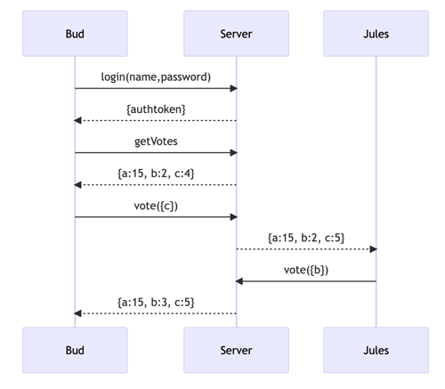

# Voter

## Description deliverable

### Elevator pitch

Have you ever endlessly debated with your friends about where to meet for lunch, or had your team bog down about an important decision that needs to be made. The Voting application makes it so a group of people can pull out their phones, clearly see the options, and pick their top three choices. As each user makes their choices the results are automatically tallied and displayed in realtime to all the other group members. Once everyone locks in their choices the group can move forward with confidence that the best option has been selected.

### Design

Here is a sequence diagram that shows how to people would interact with the backend to vote.

### Key features

- Secure login over HTTPS
- Ability to select the question to decide
- Display of choices
- Ability to select, and change, top three choices
- Totals from all users displayed in realtime
- Ability for a user to lock in their top three
- Results are persistently stored
- Ability for admin to create and delete questions

### Technologies

I am going to use the required technologies in the following ways.

- **HTML** - Uses correct HTML structure for application. Two HTML pages. One for login and one for voting. Hyperlinks to choice artifact.
- **CSS** - Application styling that looks good on different screen sizes, uses good whitespace, color choice and contrast.
- **JavaScript** - Provides login, choice display, applying votes, display other users votes, backend endpoint calls.
- **Service** - Backend service with endpoints for:
  - login
  - retrieving choices
  - submitting votes
  - retrieving vote status
- **DB** - Store users, choices, and votes in database.
- **Login** - Register and login users. Credentials securely stored in database. Can't vote unless authenticated.
- **WebSocket** - As each user votes, their votes are broadcast to all other users.
- **React** - Application ported to use the React web framework.

## HTML deliverable

For this deliverable I added the application structure.

- **HTML pages** - Two HTML page that represent the ability to login and vote.
- **Links** - The login page automatically links to the voter page. The voter page contains links for every voting choice.
- **Text** - Each of the voting choices is represented by a textual description.
- **Images** - I couldn't figure out how to include an image and so I didn't do this. 😔
- **Login** - Input box and submit button for login.
- **Database** - The voting choices represent data pulled from the database.
- **WebSocket** - The count of voting results represent the tally of realtime votes.

## CSS deliverable

For this deliverable I properly styled the application into its final appearance.

- **Header, footer, and main content body**
- **Navigation elements** - I dropped the underlines and changed the color for anchor elements.
- **Responsive to window resizing** - My app looks great on all window sizes and devices
- **Application elements** - Used good contrast and whitespace
- **Application text content** - Consistent fonts
- **Application images** - Still don't have images and so no styling here. 😔

## JavaScript deliverable

For this deliverable I made my application functional to track and display a user's three votes.

- **login** - When you press enter or the login button it takes you to the voting page.
- **database** - Displayed the voting counts. Currently this is stored and retrieved from local storage, but it will be replaced with the database data later.
- **WebSocket** - I used the setInterval function to periodically increase a random vote count. This will be replaced with WebSocket messages later.
- **application logic** - The highlight and ranking number change based up the user's selections.

## Service deliverable

For this deliverable I created an HTTP service to host my frontend and provide backend endpoints.

- **Node.js/Express HTTP service** - done!
- **Static middleware for frontend** - done!
- **Calls to third party endpoints** - I didn't have time to implement this. 😔
- **Backend service endpoints** - Placeholders for login that stores the current user on the server. Endpoints for voting.
- **Frontend calls service endpoints** - I did this use the fetch function.

## DB deliverable

For this deliverable I stored and retrieved data from MongoDB.

- **MongoDB Atlas database created** - done!
- **Endpoints for data** - My stubbed out endpoints now process the data and send it to Mongo.
- **Stores data in MongoDB** - done!

## Login deliverable

For this deliverable I added user registration and authentication.

- **User registration** - Creates a new account in the database.
- **existing user** - Verifies the user's name and password from data stored in the database
- **Use MongoDB to store credentials** - done!
- **Restricts functionality** - You cannot vote until you have logged in.

## WebSocket deliverable

For this deliverable I enabled realtime reporting of votes from other users.

- **Backend listens for WebSocket connection** - done!
- **Frontend makes WebSocket connection** - done!
- **Data sent over WebSocket connection** - done!
- **WebSocket data displayed** - All user votes display in realtime

## React deliverable

For this deliverable I port the application over to React.

- **Bundled and transpiled** - done!
- **Components** - Login, voting list, vote are all components.
- **Router** - Routing between login and voting components.
- **Hooks** - UseState to track changes in vote state.
